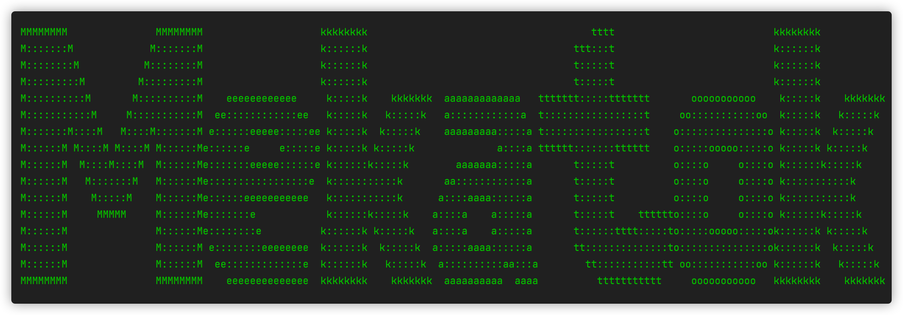

<p align="center">
	
</p>

<p align="center">
	<strong>一个基于SpringBoot实现的敏捷开发平台,一切为了简化与复用.</strong>
  <br />
	
</p>

## 简介

Mekatok是一个基于SpringBoot实现的敏捷开发平台,通过特定的模块划分和打包方式使一套代码同时支持"单体应用"和"微服务"两种交付形式.为了解决以"小项目"为主导的团队在业务沉淀,迭代复用方面的痛点.Mekatok更适用于多"初级开发"的团队,为其树立正确的开发逻辑,业务抽象能力和编码价值观.

Mekatok的出现并不是为了团队快速开始SpringBoot应用的开发,而是在有一定的项目,业务积累的时候高效的复用已有代码.

## 信条

1. 润物无声 - 自做增强不做改变,Mekatok引入的技术栈均不改变原工具使用逻辑,仅在原有基础上做符合现有业务的增强;
2. 志同道合 - 寻找和培养更多拥有相近编码价值观,业务抽象能力和工作效率的小伙伴;
3. 简单集成 - 平台内所有功能只需在maven中引入模块或通过在启动类添加自定义 *@EnableXXXX* 注解即可集成(有些插件还需要再application.yml中配置值);

## 名称由来

Mekatok的名字来源于网络游戏"魔兽世界"中,联盟阵营侏儒领袖--大工匠梅卡托克的缩写.

愿工匠精神鼓舞你我前进!!!

## 最小依赖

1. JDK 11+
2. DataBase
3. Redis

## 架构图

<p align="center">
	
</p>


## 项目结构

```
icu.guokai.mekatok
 |- app                                     # 前端项目
    |- mekatok-ui-vue                       # 前端模板 - vue3
 |- console                                 # 中后台管理
 |- document                                # 平台&项目文档
 |- expand                                  # 平台扩展项目
    |- mekatok-expand-control               # 应用监控台
    |- mekatok-expand-sso                   # 单点登录服务端
 |- external                                # 外部工具
    |- Nacos                                # Nacos服务器
    |- Redis                                # Redis服务器
    |- ...                                  # 其他外部依赖
 |- foundation                              # 平台基础功能
    |- mekatok-foundation-ou                # 组织用户功能集
    |- mekatok-foundation-disk              # 文件管理功能集
    |- mekatok-foundation-dic               # 字典功能集
 |- framework                               # 框架基础功能
    |- mekatok-framework-core               # 框架基础功能
    |- mekatok-framework-cache              # 框架缓存功能
    |- mekatok-framework-tool               # 框架工具集
    |- mekatok-framework-security           # 安全认证功能
    |- mekatok-framework-stomp              # 简单的消息队列
    |- mekatok-framework-plugin             # 平台级默认配置
    |- mekatok-framework-queue              # 框架队列功能
    |- mekatok-framework-flowable           # 工作流相关功能
    |- mekatok-framework-log                # 日志相关功能
    |- mekatok-framework-netty              # Netty 服务组件
 |- modules                                 # 模块项目
    |- moduleA                              # 模块A
        |- mekatok-moduleA-declare          # 模块A - 声明部分
        |- mekatok-moduleA-execute          # 模块A - 实现部分
        |- mekatok-moduleA-starter          # 模块A - 启动器部分
        |- pom.xml                          # 模块A - maven setting
    |- moduleB                              # 模块B
    |- ...                                  # 模块...
 |- .editorconfig                           # 编辑器格式设置
 |- lombok.config                           # Lombok基础配置文件
 |- pom.xml                                 # maven setting
 |- README.md                               # 项目介绍
```


## Mekatok如何帮助我们coding

1. 以单表CRUD为例
   1. [以前] 创建Domain和DTO,映射字段 -> 创建Mapper,添加CRUD SQL -> 创建IService和Service,添加CRUD函数 -> 创建Controller,添加CRUD路由映射 -> 测试下,好用
   2. [现在] 创建Table对象,映射字段 -> 创建空Mapper接口 -> 创建空Controller类 -> 统一实现,理论无需测试

2. 以使用缓存为例
   1. [以前] 打开搜索引擎 -> 搜"springboot 缓存" -> 打开某篇博客 -> 拿到关键字,去项目里找找有没有已经实现的 -> 找到了就复用,没有就自己根据博客内容添加 -> 改改,好用
   2. [现在] CacheCenter.get(), CacheCenter.put(), CacheCenter.remove();
3. 以计算MD5为例
   1. [以前] 打开搜索引擎 -> 搜“Java MD5加密” -> 打开某篇博客-> 复制粘贴 -> 改改好用
   2. [现在] SecureUtil.md5()
4. 以业务复用为例
   1. [以前] 找到以前项目的源码 -> 分析源码与现有框架的差异 -> 一个一个类的迁移 -> 创建配置类,配置模块基本设置 -> 修改测试,好用
   2. [现在] maven 中直接引入 module-xxx-starter 

## 依赖环境

|      依赖组件      |   版本   |        描述         |
| :----------------: | :------: | :-----------------: |
|        JDK         |   11+    |    java开发工具     |
|    Spring Boot     |  2.4.1   |    Spring全家桶     |
|       Hutool       |  5.6.0   |     静态工具类      |
|       Forest       |  1.5.11  |     函数式http client     |
|      MyBatis       |  3.5.6   |     持久化工具      |
|    MyBatis-Plus    |  3.4.3   |   持久化工具扩展    |
|      knife4j       |  2.0.8   |   Swagger UI增强    |
|      Swagger       |  2.10.5  |    在线接口文档     |
|  flowable-spring   |  6.6.0   |     工作流引擎      |
|    reflections     |  0.9.12  |    反射增强工具     |
|        JNA         |  5.7.0   |  java本地接口访问   |
|    ganymed-ssh2    | build210 |  ssh-2协议的java库  |
| dynamic-datasource |  3.3.2   |   多数据源管理工具    |
| spring-boot-admin  |  2.3.1   | spring应用监控  |
| liteflow | 2.6.3 | 流程编排工具 |

## 快速上手

1. 在modules目录下创建你的模块;
2. pom文件中引入 **mekatok-framework-plugin**;
3. 创建application.yml(或properties文件),配置平台依赖参数,如数据库链接和插件配置项等;
4. 创建SpringBootApplication启动类.生成main方法,添加注解@MekatokApplication(无需再添加@SpringBootApplication);
5. 启动main方法;

项目启动后,除正常的启动Springboot应用外.还默认集成并配置了异步任务支持,路由环绕打印,主机序列号校验,客户端IP校验,MVC异常统一处理,http与https双通道监听,Mybatis增强与动态数据源,SpringUtil增强,Swagger与knife4j开启与配置;

## 帮助文档

* [Mekatok平台中ActiveRecord模式使用方法](./document/Mekatok平台中ActiveRecord模式使用方法.md)
* [Mekatok平台中Cache的使用方法](./document/Mekatok平台中Cache的使用方法.md)
* [Mekatok平台中Controller的开发规范](./document/Mekatok平台中Controller的开发规范.md)
* [Mekatok平台中Flowable工作流的使用方法](./document/Mekatok平台中Flowable工作流的使用方法.md)
* [Mekatok平台中IService和Impl的开发规范](./document/Mekatok平台中IService和Impl的开发规范.md)
* [Mekatok平台中JSR107函数级缓存使用方法](./document/Mekatok平台中JSR107函数级缓存使用方法.md)
* [Mekatok平台中Mapper和xml的开发规范](./document/Mekatok平台中Mapper和xml的开发规范.md)
* [Mekatok平台中Redis消息队列的使用方法](./document/Mekatok平台中Redis消息队列的使用方法.md)
* [Mekatok平台中Security的使用与配置方法](./document/Mekatok平台中Security的使用与配置方法.md)
* [Mekatok平台中Swagger接口分组的使用方法](./document/Mekatok平台中Swagger接口分组的使用方法.md)
* [Mekatok平台中WebSocket消息队列使用方法](./document/Mekatok平台中WebSocket消息队列使用方法.md)
* [Mekatok平台中三级Bean抽象的使用方法](./document/Mekatok平台中三级Bean抽象的使用方法.md)
* [Mekatok平台中业务级流式断言的使用](./document/Mekatok平台中业务级流式断言的使用.md)
* [Mekatok平台中主机和客户端校验的实现方式](./document/Mekatok平台中主机和客户端校验的实现方式.md)
* [Mekatok平台中使用Redis作为Dubbo的注册中心的使用方法](./document/Mekatok平台中使用Redis作为Dubbo的注册中心的使用方法.md)
* [Mekatok平台中分页的获取与使用方法](./document/Mekatok平台中分页的获取与使用方法.md)
* [Mekatok平台中单体应用实现方案](./document/Mekatok平台中单体应用实现方案.md)
* [Mekatok平台中同时支持单体和微服务打包](./document/Mekatok平台中同时支持单体和微服务打包.md)
* [Mekatok平台中大屏展示解决方案](./document/Mekatok平台中大屏展示解决方案.md)
* [Mekatok平台中如何实现数据默认缓存实现](./document/Mekatok平台中如何实现数据默认缓存实现.md)
* [Mekatok平台中工具集使用逻辑](./document/Mekatok平台中工具集使用逻辑.md)
* [Mekatok平台中应用健康监控使用方法](./document/Mekatok平台中应用健康监控使用方法.md)
* [Mekatok平台中异步任务调度的使用方法](./document/Mekatok平台中异步任务调度的使用方法.md)
* [Mekatok平台中微服务应用实现方案](./document/Mekatok平台中微服务应用实现方案.md)
* [Mekatok平台中插件的使用方法](./document/Mekatok平台中插件的使用方法.md)
* [Mekatok平台中模块划分的开发规范](./document/Mekatok平台中模块划分的开发规范.md)
* [Mekatok平台中自定义事件的使用方法](./document/Mekatok平台中自定义事件的使用方法.md)
* [Mekatok平台中自定义异常的创建使用与规范](./document/Mekatok平台中自定义异常的创建使用与规范.md)
* [Mekatok平台中部分配置的使用方法](./document/Mekatok平台中部分配置的使用方法.md)
* [Mekatok平台中集合类扩展的使用](./document/Mekatok平台中集合类扩展的使用.md)

## 延伸功能

1. 基于SpringBootAdmin的应用健康监控 --  **expand/mekatok-expand-control** 应用健康服务端,可视化的查看应用健康状况,缓存,Spring BeanFactory, 内存使用,心跳等等;
2. 基于OAuth2授权码模式的统一认证 --  **expand/mekatok-expand-sso** (暂未实现);
3. 基于websocket使用STOMP协议实现的前后端消息队列演示客户端 -- **external/stomp**;
4. 基于Redis实现的缓存中心,通过静态函数的方式暴露缓存的使用.并支持JSR107标准实现函数级缓存 -- **framework/mekatok-framework-cache**;
5. 基于ApplicationEvent的自定义事件,通过静态函数的方式发布事件.支持标准 *@EventListener* 订阅 -- **framework/mekatok-framework-plugin**;
6. 基于Mybatis Plus实现的ActiveRecord模式对象持久化,在项目中既可以自定义写SQL.又在单表操作时支持 *bean.save();* *bean.delete();* *bean.push();* -- **framework/mekatok-framework-core**;
7. 基于缓存中心实现的平台级单表操作均以缓存形式实现,数据表中单行数据的CRUD均以缓存为主; -- **framework/mekatok-framework-core**;
8. 基于RuntImeException延伸的全套自定义异常映射流程管理.包括通过注解为异常编码.异常处理器的统一拦截加工; -- **framework/mekatok-framework-core**;
9. Model, View, Table 三级java bean抽象,满足在不需要时,尽可能少的创建domain和DTO; -- **framework/mekatok-framework-core**;
10. 基于Servlet数据共享实现的分页获取机制,通过静态函数让请求在线程内任何位置获取分页数据; -- **framework/mekatok-framework-core**;
11. 基于ActiveRecord模式对象持久化的支持,平台内可以在controller的接口中实现单表CRUD零代码开发; -- **framework/mekatok-framework-core**;
12. 基于flowable实现的工作流引擎,通过静态函数实现流程的装载,查询,操作; -- **framework/mekatok-framework-flowable**;
13. 基于AsyncTaskExecutor实现的异步任务统一调度; -- **framework/mekatok-framework-plugin**;
14. 基于Spring Security实现的安全查询工具,通过静态函数的方式获取当前认证用户相关信息,对象空安全; -- **framework/mekatok-framework-security**;
15. 基于Docket的Swagger分组显示,只需实现平台内特定Bean返回对应字段值; -- **framework/mekatok-framework-plugin**;
16. 基于Filter实现的客户端IP校验; -- **framework/mekatok-framework-plugin**;
17. 基于ApplicationStartedEvent事件监听实现的主机序列号校验; -- **framework/mekatok-framework-plugin**;
18. 基于Redis实现的消息队列,通过静态函数发布消息,并通过向Spring容器中加入特定接口实现类来订阅频道; -- **framework/mekatok-framework-queue**;
19. 基于Spring Security实现的安全校验与权限认证,通过注解 *@EnableSimpleSecurity* 和 *@OauthSecurityConfiguration* 开启不同的认证方式; -- **framework/mekatok-framework-security**;
20. 基于WebSocket使用STOMP协议实现的自建消息队列,实现浏览器间一对多,一对一或广播的消息通讯; -- **framework/mekatok-framework-stomp**;

21. 基于Redis实现的微服务注册中心;

