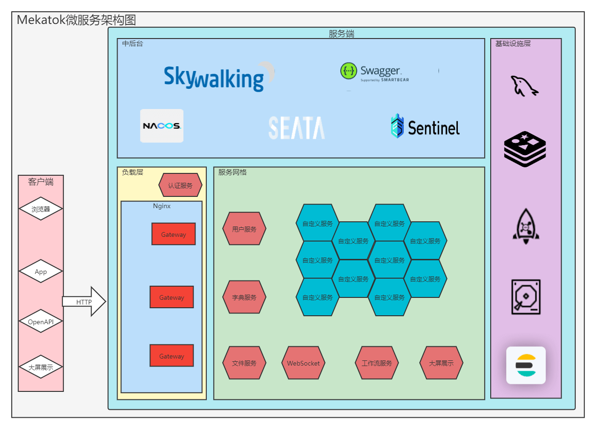

<p align="center">
	<strong>一个基于Gateway,Nacos,OpenFeign,Seata和Sentinel实现并使用Skywalking和Knife4j的微服务开发包.</strong>
  <br />
	
    
</p>

## 简介

Mekatok是一个微服务架构开发架子.为了解决以"小项目"为主导的团队在业务沉淀,迭代复用方面的痛点.Mekatok更适用于多"初级开发"的团队,为其树立正确的开发逻辑,业务抽象能力和编码价值观.Mekatok的出现并不是为了团队快速开始SpringBoot应用的开发,而是在有一定的项目,业务积累的时候高效的复用已有代码.

## 信条

1. 润物无声 - 只做增强不做改变,Mekatok引入的技术栈均不改变原工具使用逻辑,仅在原有基础上做符合现有业务的增强;
2. 志同道合 - 寻找和培养更多拥有相近编码价值观,业务抽象能力和工作效率的小伙伴;
3. 简单集成 - 平台内所有功能只需引入模块或通过在启动类添加自定义 *@EnableXXXX* 注解即可集成(有些功能还能在application.yml中配置值);

## 名称由来

Mekatok的名字来源于网络游戏"魔兽世界"中,联盟阵营侏儒领袖--大工匠梅卡托克的缩写.

愿工匠精神鼓舞你我前进!!!

## 最小依赖

1. JDK8
2. MySQL8
3. Redis
3. Nacos2.0.3
3. Seata1.3.0

## 架构图



## 项目结构

```
mekatok
 |- docker                                                    # 编排文件
 |- docs                                                      # 编辑器格式设置
 |- jenkins                                                   # 流水线文件
 |- mekatok-foundation-common                                 # 通用模块
 |- mekatok-foundation-context                                # 上下文模块
 |- mekatok-foundation-core                                   # 核心模块
 |- mekatok-foundation-jdbc                                   # 数据库模块
 |- mekatok-foundation-junit                                  # 测试模块
 |- mekatok-foundation-message                                # 消息队列模块
 |- mekatok-foundation-microservice                           # 微服务依赖(事务,流控,RPC)
 |- mekatok-foundation-openapi                                # 开放文档模块
 |- mekatok-foundation-redisson                               # redis模块
 |- mekatok-foundation-webflux                                # 响应模式依赖
 |- mekatok-foundation-webmvc                                 # mvc模式依赖
 |- mekatok-foundation-websocket                              # socket模式依赖
 |- mekatok-platform-actuator                                 # 应用监控服务
 |- mekatok-platform-auth                                     # 认证鉴权模块
 	|- mekatok-platform-auth-expose                           # 认证鉴权定义
 	|- mekatok-platform-auth-service                          # 认证鉴权服务
 |- mekatok-platform-dic                                      # 字典缓存模块
 	|- mekatok-platform-dic-expose                            # 字典缓存定义
 	|- mekatok-platform-dic-service                           # 字典缓存服务
 |- mekatok-platform-gateway                                  # 网关路由模块
 |- mekatok-platform-notice                                   # WebSocket模块
 	|- mekatok-platform-notice-expose                         # 通讯模块定义
 	|- mekatok-platform-notice-service                        # 通讯模块服务
 |- mekatok-platform-oss                                      # 对象存储模块
 	|- mekatok-platform-oss-expose                            # 对象存储定义
 	|- mekatok-platform-oss-service                           # 对象存储服务
 |- mekatok-platform-user                                     # 用户中心模块
 	|- mekatok-platform-user-expose                           # 用户中心定义
 	|- mekatok-platform-user-service                          # 用户中心服务
 |- .editorconfig                                             # 编辑器格式设置
 |- lombok.config                                             # Lombok基础配置文件
```

## 依赖环境

|      依赖组件      |   版本   |
| :----------------: | :------: |
|        JDK         |   8    |
|    Spring Boot     |  2.3.12.RELEASE  |
| Spring Cloud | Hoxton.SR12 |
| Spring Cloud Alibaba | 2.2.7.RELEASE |
| Mybatis Plus | 3.5.1 |
|       Hutool       | 5.7.20 |
| EasyExcel | 3.0.5 |

## 快速上手

1. 安装JDK8并配置环境变量;

2. 拉取源码, 打开pom.xml文件, 修改 properties -> jar.output.path的值为项目根目录的绝对路径;

3. 在本机环境中, 添加host映射 guokai.me -> 127.0.0.1;

4. 下载MySQL Server, 运行并暴露端口3306, 用户名密码均为root;

5. 在MySQL中依次创建数据库: mekatok_user, mekatok_dic, mekatok_oss;

6. 下载[Redis Server](https://download.redis.io/releases/redis-6.2.6.tar.gz), 运行并暴露端口6379, 无用户名密码;

7. 下载[Nacos Server](https://github.com/alibaba/nacos/releases/download/2.0.3/nacos-server-2.0.3.zip), 运行并暴露端口8848;

8. 下载[Seata Server](https://github.com/seata/seata/releases/download/v1.3.0/seata-server-1.3.0.zip), 运行并暴露端口8091;

9. 下载[Sentinel Server](https://github.com/alibaba/Sentinel/releases/download/1.8.1/sentinel-dashboard-1.8.1.jar), 运行并暴露端口8858;

10. 下载[Skywalking APM](https://www.apache.org/dyn/closer.cgi/skywalking/8.9.1/apache-skywalking-apm-8.9.1.tar.gz), 运行并暴露端口8888;

11. 下载 [Skywalking Agent](https://www.apache.org/dyn/closer.cgi/skywalking/java-agent/8.9.0/apache-skywalking-java-agent-8.9.0.tgz), 存放到指定位置***${agent_home}***备用;

12. 为启动的服务配置Java探针, 替换 ${agent_home}为真实路径, ${service_name}为真实服务名;

    ```shell
    java -javaagent:${agent_home}/skywalking-agent.jar -Dskywalking.agent.service_name=${service_name} -jar mekatok-platform-xxx.jar
    ```

    

13. 分别启动 以下七个服务;

    1.  com.github.guokaia.mekatok.gateway.GatewayApplication
    2.  com.github.guokaia.mekatok.actuator.ActuatorApplication
    3.  com.github.guokaia.mekatok.auth.service.AuthApplication
    4.  com.github.guokaia.mekatok.dic.service.DicApplication
    5.  com.github.guokaia.mekatok.notice.service.NoticeApplication
    6.  com.github.guokaia.mekatok.oss.service.OssApplication
    7.  com.github.guokaia.mekatok.user.service.UserApplication
    
14. 用户名密码均为: mekatok;


## 开发监控

1. 网关地址: http://guokai.me:11202
2. Swagger地址: http://guokai.me:11202/doc.html
3. Actuator地址: http://guokai.me:33333
4. Skywalking地址: http://guokai.me:8888
5. Sentinel地址: http://guokai.me:8858
6. Nacos地址: http://guokai.me:8848

## 帮助文档

* coming soon
